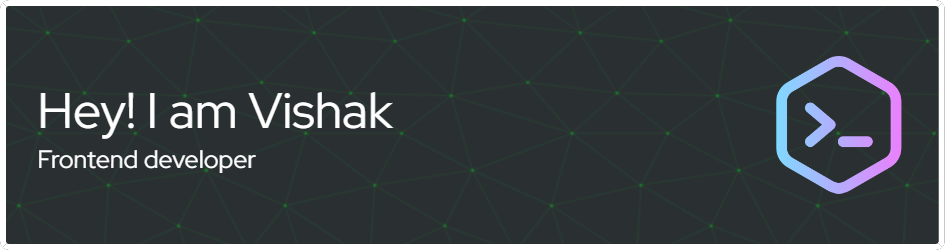

<h1 align="center">Hi 👋, I'm Vishak</h1>
<h3 align="center">A passionate frontend developer from India</h3>

  

  

  

- 🌱 I’m currently learning **React**

- 👨‍💻 All of my projects are available at [www.demo.in](www.demo.in)

- 💬 Ask me about **react**

- 📫 How to reach me **vishakvn007@gmail.com**

<h3 align="left">Connect with me:</h3>

<h3 align="left">Languages and Tools:</h3>

           

&nbsp;

